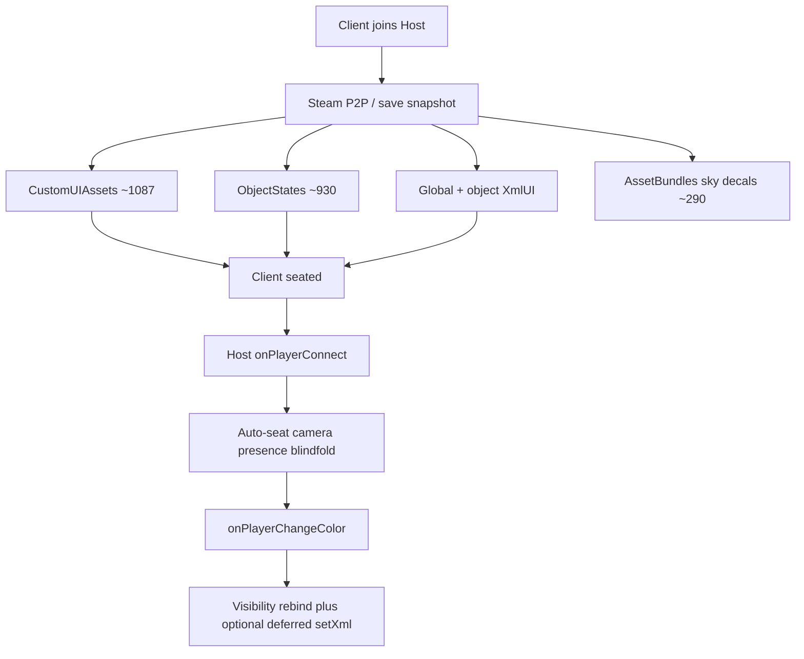

# Join-Load Inventory

## Agent Routing

Read this when:
- a join client connection-timeouts or hangs on Loading
- planning defer/batch work for CustomUIAssets, ObjectStates, or connect Lua
- deciding whether Host Lua vs TTS engine load is the bottleneck

Source of truth:
- Host Lua: `core/global_script.ttslua` (`onPlayerConnect`, `onPlayerChangeColor`, `refreshGlobalUiAfterSeatAssignment`)
- Engine load model: `.tools/tts-save/list-save-loading-assets.js` → `.dev/build-logs/save-loading-assets-latest.*`
- Join-stress controls: `gameState.connectionControls` (TOR-428 / TOR-430 / TOR-432)

Verification:
- `npm run tts-save:list-loading-assets`
- Multiclient: Defer Connect + Defer Auto-Seat + Defer setXML playbook (below)
- Author: confirm whether hang is on **Loading (N/M)** vs after seated

Status: current research baseline (2026-07-30). Regenerated counts from `.dev/TS_Save_230.json`.

Related: [Preparing For Multiplayer](Preparing%20For%20Multiplayer.md), [Multiplayer-Session-Investigation-2026-07-12](Multiplayer-Session-Investigation-2026-07-12.md), [tts-xmlui-visibility-seat-assignment](../../docs/solutions/tts-xmlui-visibility-seat-assignment.md), [lua-ui-full-xml-policy](../../docs/solutions/lua-ui-full-xml-policy.md).

---

## Executive verdict

**Connection timeouts are primarily TTS engine join cost** (download/parse CustomUIAssets + replicate ObjectStates + XmlUI), not Host `onPlayerConnect` Lua.

Host Lua already has join-stress gates. Full Global `UI.setXml` on Grey→PC has **correlated with timeouts** — do **not** redesign around “minimal Global.xml + Host setXml bootstrap.” Prefer prune + defer assets/objects; keep setXml as a rare manual fallback (Defer setXML / Refresh XML).



---

## Snapshot counts (save 230, 2026-07-30)

| Bucket | Count | Notes |
| --- | ---: | --- |
| Global `CustomUIAssets` | **1087** | Was ~579 in older docs — registry roughly doubled |
| `ObjectStates` (loading-bar model) | **930** | Was ~443 |
| **Loading-bar model total** | **2017** | Formula in TTS_BUNDLING_SETUP; in-game N/M may still dedupe |
| Excluded Custom_Assetbundle | 241 | Still loaded; see extras |
| Excluded Block* / HandTrigger | 62 / 6 | |
| Extras (bundles + sky + decals) | 290 | Not always in Loading N/M |

Regenerate:

```powershell
npm run tts-save:list-loading-assets
```

Outputs: `.dev/build-logs/save-loading-assets-latest.{csv,json,md}` (+ `*-extras.csv`).

### Custom UI name prefixes (largest)

| Prefix / family | ~Count | Defer candidate? |
| --- | ---: | --- |
| `siteCard_*` | 168 | Yes — batch after Intermission roster |
| `tokenFront_*` / `tokenBack_*` | 108 + 108 | Yes — NPC token art |
| `toggleDistrict_*` / `toggle*` / `toggleOverlay_*` | 108 + 82 + 54 | Maybe — map/ST chrome |
| `mapOverlay_*` / `overlay_*` | 50 + 44 | Partial — keep minimal blindfold overlays |
| `districtCard_*` | 36 | Yes — with site cards |
| `refPanel_*` | 30 | Low priority |
| Misc / character-named / other | remainder of 1087 | Prune unused first |

### ObjectStates categories (largest)

| Category | ~Count | Notes |
| --- | ---: | --- |
| `cardOrDeck` | 318 | ContainedObjects multiply rows |
| `dice` | 286 | Includes preload pool |
| `tile` | 157 | Control tokens, companions, etc. |
| `figurine` | 116 | NPC preload pool under table |
| `infiniteBag` | 22 | |
| other / customImage | ~31 | |

---

## Host Lua connect path (ordered)

All of this runs **on the Host only** after the client is already in the session (or while still connecting — engine timing is opaque).

### `onPlayerConnect` (`core/global_script.ttslua`)

1. Resolve `Player` from arg.
2. **TOR-430 Defer Connect** — O(1) Steam → chronicle PC color → if `connectionControls.deferConnectByColor[color]`, **return** (no seat/camera/presence/blindfold).
3. Clear seat-HUD reveal cache; mark `pendingConnectSeatRefreshByPlayer`.
4. `M.tryAutoAssignSeatFromChronicle` — skipped when **Defer Auto-Seat** (TOR-428) for target color; else Grey→chronicle seat (may fire `onPlayerChangeColor`).
5. Default camera + `PlayerConnection.reconcileEffectivePresence` (TOR-293).
6. If not Intermission: `Phases.lowerBlindfoldForConnectingPlayer` (TOR-319).

Manual **Connect** button: `M.manualRunPlayerConnect(color)` → `onPlayerConnect(player, true)` (bypasses Defer Connect).

### `onPlayerChangeColor`

1. Ignore Grey.
2. `M.onPlayerChangeColor` (state row).
3. If pending connect refresh **or** join client (not Host): `refreshGlobalUiAfterSeatAssignment`.
4. That path: **visibility rebind** (`revealSeatHudVisibility`) + targeted `UpdateUIDisplays`; schedules **deferred Global `UI.setXml`** fallback (~4s) unless **Defer setXML** (TOR-381 / TOR-428).

### Cost relative to engine load

Host Lua here is **cheap** compared to ~2000 loading-bar rows. The dangerous Host action is **full document `UI.setXml`**, already gated.

---

## Ranked defer / relief candidates

| Rank | Avenue | Upside | Risk | Next step |
| ---: | --- | --- | --- | --- |
| 1 | **Operational playbook** (existing Defer toggles) | Immediate; no architecture change | Needs author/player discipline | Use for struggling seats every join |
| 2 | **Prune unused CustomUIAssets** | Cuts Loading bar without runtime batching | Need reference audit so used art stays | `tts-save:extract-assets` / custom-ui prune dry-run |
| 3 | **Slim Intermission CustomUIAssets + `UI.setCustomAssets` batches** | Large join win if engine loads full registry on connect | API **replaces** entire registry; late joiners / mid-session Host must re-apply batches | Spike: empty→minimal→add siteCard batch; measure join Loading N/M |
| 4 | **Cold table: park preload pools** (NPC figurines, dice) until Host spawn | Shrinks ObjectStates ~100–400 | Late spawn still hits mid-session joiners; Apply UX changes | Inventory GUIDs/tags; Host “Warm NPC pool” / “Warm dice” buttons |
| 5 | **Lobby save vs full chronicle save** | Clearest engine win | Ops heavy (two saves, promotion workflow) | Only if prune + batches insufficient |
| **Out** | Minimal Global.xml + Host `setXml` to mount HUD | — | Documented timeout correlation (TOR-375) | Do not pursue for v1 |

### `UI.setCustomAssets` research notes

From TTS API (`.dev/tts-api/Scripting API/UI.md`):
- Replaces **all** Global Custom UI assets (empty table clears).
- Images only; no merge API.

Open questions (spike, not assumed):
1. Does a join client download **every** save-root CustomUIAssets URL during Loading even if unused by current XmlUI?
2. After Host `setCustomAssets`, do connected clients pull new URLs immediately? Do late joiners only see the current registry?
3. Can object XmlUI keep object-local CustomUIAssets while Global HUD uses a slim set?

---

## Immediate playbook (before more code)

1. Phase = Intermission (global blindfold already up).
2. For the struggling PC: enable **Defer Connect**, **Defer Auto-Seat**, and Phases **Defer setXML**.
3. Have them join; wait until Loading finishes / they appear Grey.
4. Host: **Auto-Seat** → (if Defer Connect was on) **Connect** → when HUD needed, **Refresh XML**.
5. Ask them: hang on **Loading (N/M)** or after the table is visible?

If hang is on Loading, Host Lua defer alone cannot fix it — pursue ranks 2–4.

---

## Author open questions

- Exact timeout timing (Loading bar vs post-seat vs Grey→color).
- Whether Defer triad already tried for that Steam ID.
- Whether their TTS image cache was cold (first join after clear/reinstall).

---

## Follow-up work (not started)

- Linear research epic: join-load reduction (this inventory is the baseline).
- Experiment #1: CustomUIAssets prune report + optional Intermission-minimal registry spike.
- Experiment #2: Host-warmed NPC/dice preload (ObjectStates cold start).
