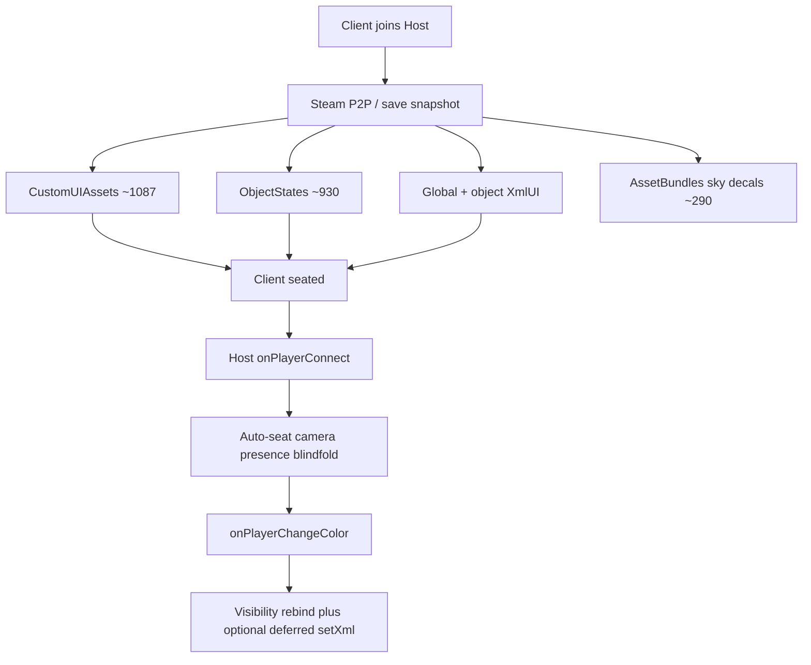

# Join-Load Inventory

## Agent Routing

Read this when:
- a join client connection-timeouts or hangs on Loading
- planning defer/batch work for CustomUIAssets, ObjectStates, or connect Lua
- deciding whether Host Lua vs TTS engine load is the bottleneck

Source of truth:
- Host Lua: `core/global_script.ttslua` (`onPlayerConnect`, `onPlayerChangeColor`, `refreshGlobalUiAfterSeatAssignment`)
- Engine load model: `.tools/tts-save/list-save-loading-assets.js` → `.dev/build-logs/save-loading-assets-latest.*`
- Join-stress controls: `gameState.connectionControls` (TOR-428 / TOR-430 / TOR-432)

Verification:
- `npm run tts-save:list-loading-assets`
- Multiclient: Defer Connect + Defer Auto-Seat + Defer setXML playbook (below)
- Author: confirm whether hang is on **Loading (N/M)** vs after seated

Status: current research baseline (2026-07-30). Regenerated counts from `.dev/TS_Save_230.json`.

Related: [Preparing For Multiplayer](Preparing%20For%20Multiplayer.md), [Multiplayer-Session-Investigation-2026-07-12](Multiplayer-Session-Investigation-2026-07-12.md), [tts-xmlui-visibility-seat-assignment](../../docs/solutions/tts-xmlui-visibility-seat-assignment.md), [lua-ui-full-xml-policy](../../docs/solutions/lua-ui-full-xml-policy.md), Host Lua scheduling after timing merge: [Agent-Handoff-Timing-API](../Timing%20Optimizations/Agent-Handoff-Timing-API.md).

---

## Executive verdict

**Connection timeouts are primarily TTS engine join cost** (download/parse CustomUIAssets + replicate ObjectStates + XmlUI), not Host `onPlayerConnect` Lua.

Host Lua already has join-stress gates. Full Global document remount on Grey→PC has **correlated with timeouts** — keep remount rare (Defer setXML / Refresh XML). **Experiment #0** (TOR-439) tests whether *joining into* a minimal Global XmlUI avoids post-Loading timeouts; it is diagnostic only, not the permanent architecture.



---

## Snapshot counts (save 230, 2026-07-30)

| Bucket | Count | Notes |
| --- | ---: | --- |
| Global `CustomUIAssets` | **1087** | Was ~579 in older docs — registry roughly doubled |
| `ObjectStates` (loading-bar model) | **930** | Was ~443 |
| **Loading-bar model total** | **2017** | Formula in TTS_BUNDLING_SETUP; in-game N/M may still dedupe |
| Excluded Custom_Assetbundle | 241 | Still loaded; see extras |
| Excluded Block* / HandTrigger | 62 / 6 | |
| Extras (bundles + sky + decals) | 290 | Not always in Loading N/M |

Regenerate:

```powershell
npm run tts-save:list-loading-assets
```

Outputs: `.dev/build-logs/save-loading-assets-latest.{csv,json,md}` (+ `*-extras.csv`).

### Custom UI name prefixes (largest)

| Prefix / family | ~Count | Defer candidate? |
| --- | ---: | --- |
| `siteCard_*` | 168 | Yes — batch after Intermission roster |
| `tokenFront_*` / `tokenBack_*` | 108 + 108 | Yes — NPC token art |
| `toggleDistrict_*` / `toggle*` / `toggleOverlay_*` | 108 + 82 + 54 | Maybe — map/ST chrome |
| `mapOverlay_*` / `overlay_*` | 50 + 44 | Partial — keep minimal blindfold overlays |
| `districtCard_*` | 36 | Yes — with site cards |
| `refPanel_*` | 30 | Low priority |
| Misc / character-named / other | remainder of 1087 | Prune unused first |

### ObjectStates categories (largest)

| Category | ~Count | Notes |
| --- | ---: | --- |
| `cardOrDeck` | 318 | ContainedObjects multiply rows |
| `dice` | 286 | Includes preload pool |
| `tile` | 157 | Control tokens, companions, etc. |
| `figurine` | 116 | NPC preload pool under table |
| `infiniteBag` | 22 | |
| other / customImage | ~31 | |

---

## Host Lua connect path (ordered)

All of this runs **on the Host only** after the client is already in the session (or while still connecting — engine timing is opaque).

### `onPlayerConnect` (`core/global_script.ttslua`)

1. Resolve `Player` from arg.
2. **TOR-430 Defer Connect** — O(1) Steam → chronicle PC color → if `connectionControls.deferConnectByColor[color]`, **return** (no seat/camera/presence/blindfold).
3. Clear seat-HUD reveal cache; mark `pendingConnectSeatRefreshByPlayer`.
4. `M.tryAutoAssignSeatFromChronicle` — skipped when **Defer Auto-Seat** (TOR-428) for target color; else Grey→chronicle seat (may fire `onPlayerChangeColor`).
5. Default camera + `PlayerConnection.reconcileEffectivePresence` (TOR-293).
6. If not Intermission: `Phases.lowerBlindfoldForConnectingPlayer` (TOR-319).

Manual **Connect** button: `M.manualRunPlayerConnect(color)` → `onPlayerConnect(player, true)` (bypasses Defer Connect).

### `onPlayerChangeColor`

1. Ignore Grey.
2. `M.onPlayerChangeColor` (state row).
3. If pending connect refresh **or** join client (not Host): `refreshGlobalUiAfterSeatAssignment`.
4. That path: **visibility rebind** (`revealSeatHudVisibility`) + targeted `UpdateUIDisplays`; schedules **deferred Global `UI.setXml`** fallback (~4s) unless **Defer setXML** (TOR-381 / TOR-428).

### Cost relative to engine load

Host Lua here is **cheap** compared to ~2000 loading-bar rows. The dangerous Host action is **full document `UI.setXml`**, already gated.

---

## Ranked defer / relief candidates

| Rank | Avenue | Upside | Risk | Next step |
| ---: | --- | --- | --- | --- |
| **0** | **Experiment: Arm Join XML** (minimal Global XmlUI → Refresh remount) | Isolates whether heavy Global XmlUI at connect drives post-Loading timeouts | Host loses full HUD while armed; remount may still timeout; embeds ~2MB into Global Lua | Phases **Arm Join XML** before joiner; settle Grey; Auto-Seat/Connect; **Refresh XML**. Record control vs treatment. Timing: [Agent-Handoff-Timing-API](../Timing%20Optimizations/Agent-Handoff-Timing-API.md). _(TOR-439)_ |
| 1 | **Operational playbook** (existing Defer toggles) | Immediate; no architecture change | Needs author/player discipline | Use for struggling seats every join |
| 2 | **Prune unused CustomUIAssets** | Cuts Loading bar without runtime batching | Need reference audit so used art stays | `tts-save:extract-assets` / custom-ui prune dry-run |
| 3 | **Slim Intermission CustomUIAssets + `UI.setCustomAssets`** | Large join win if engine loads full registry on connect | API **replaces** entire registry (no merge); Host must restore on Refresh/Disarm | TOR-439 Arm: `getCustomAssets` backup → slim keep-list → `setCustomAssets`; Refresh restores |
| 4 | **Cold table: park preload pools** (NPC figurines, dice, emitters) | Shrinks ObjectStates ~100–400+ | GUID-preserving destroy/restore; late joiners still need warm before use | TOR-439 Arm: `JoinColdPools.beginCold` / `beginWarm` (preload NPCs + soundscape emitters). Dice pool still open. |
| 5 | **Lobby save vs full chronicle save** | Clearest engine win | Ops heavy (two saves, promotion workflow) | Only if prune + batches insufficient |

### Experiment #0 — minimal Global XmlUI (TOR-439)

**Not** the permanent default save XmlUI. Host arms at runtime; Remount uses build-embedded full XML (`npm run ui-global-xml:embed` → `lib.ui_global_xml_docs`).

**Control:** Defer triad on; full XmlUI; join → settle Grey → Auto-Seat (+ Connect if needed); no Refresh. Record timeout Y/N.

**Treatment:** Host alone → Phases **Arm Join XML** (auto-enables Defer setXML) → joiner connects → settle → Auto-Seat/Connect → **Refresh XML** (or **Disarm Join XML**). Record: survive join? survive Refresh?

Sources: `ui/Global.join_minimal.xml`, Phases Arm/Disarm/Refresh in `core/global_script.ttslua`.

#### Armed-save load (CustomUIAssets Q1 — Host alone)

Goal: load a save whose **Global XmlUI is already minimal**, preferably with a **slimmed** CustomUIAssets registry from Arm’s `UI.setCustomAssets`, and never remount full HUD before observing Loading.

1. **Save & Play** once with current TOR-439 scripts (so Lua has Arm slim + onLoad armed remount).
2. In TTS (solo): **Arm Join XML**; confirm slim chrome + console `[JoinXmlAssets] setCustomAssets slim …`.
3. **Either:**
   - **A (in-game, preferred for asset slim):** TTS **File → Save** (not Save & Play) while armed — persists `joinXmlArmed`, `joinXmlCustomAssetsBackup`, current XmlUI, and (if TTS writes runtime assets) the slim CustomUIAssets registry; or
   - **B (disk XmlUI only):** `npm run tts-save:inject-join-minimal -- --saveName <id>`
     Writes expanded minimal XmlUI + armed flags **without** replacing `LuaScript`. Does **not** slim CustomUIAssets on disk — use after Arm+File Save, or accept full registry until onLoad Arm slim runs (too late for Loading N/M).
4. **File → Load** that save. Watch Loading (N/M). After load, Host stays on minimal chrome (`onLoad` remounts minimal when `joinXmlArmed`; restores backup only on Refresh/Disarm).
5. **Do not** Save & Play or `tts-save:inject-global` before that load — those rewrite **full** `XmlUI`.

Open questions: (Q1) does Loading pull every save-root CustomUIAssets URL even when XmlUI is minimal? (Q1b) after Arm+File Save, is the save’s CustomUIAssets array already slim?

### Cold ObjectStates pools (TOR-439)

Arm also destroys **preload-area** NPC figurines + paired lights and all **soundscape emitters**, snapshots `getData()`, and restores via `spawnObjectData` with **`GUID` kept**. Wait until `getObjectFromGUID` is nil before spawn; assert GUID after warm. Module: `core/join_cold_pools.ttslua`.

- Seated / stage NPCs are **not** destroyed.
- Dice preload pool is **not** included yet (larger ObjectStates slice — follow-on).
- Soundscape `reconcileFromState` and NPC preload audit **no-op** while `joinColdPoolsActive`.
- Backup persists in `connectionControls.joinColdPoolsBackup` (can be large — File Save after Arm may grow `LuaScriptState`).

### `UI.setCustomAssets` research notes

API: [getCustomAssets](https://api.tabletopsimulator.com/ui/#getcustomassets) / [setCustomAssets](https://api.tabletopsimulator.com/ui/#setcustomassets) (also `.dev/tts-api/Scripting API/UI.md`):
- `getCustomAssets()` returns the current Global custom-asset table.
- `setCustomAssets(assets)` **replaces** the entire registry (empty table clears). Images only; **no merge**.
- TOR-439 Arm path: backup via `getCustomAssets` → `setCustomAssets` filtered to join-minimal keep-list (`lib.ui_global_xml_docs.getMinimalAssetNames`); Refresh/Disarm restores backup then remounts full XmlUI.

**Answered (author, 2026-07-30):**

3. **Object XmlUI vs Global assets** — Yes; they **must** use object-local Custom Assets. Object-hosted XmlUI **cannot** read Global CustomUIAssets at all. Slimming Global and hoping objects “share” those images is a non-starter. Overlap that exists today (icons, stat dots, other small shared art duplicated on Global + objects) is small; moving or deduping it would yield **negligible** Loading-bar savings. Do not rank “dedupe Global↔object CustomUIAssets” as a join win.

Still open (spike, not assumed):
1. Does a join client download **every** save-root CustomUIAssets URL during Loading even if unused by current XmlUI?
2. After Host `setCustomAssets`, do connected clients pull new URLs immediately? Do late joiners only see the current registry?

---

## Immediate playbook (before more code)

1. Phase = Intermission (global blindfold already up).
2. For the struggling PC: enable **Defer Connect**, **Defer Auto-Seat**, and Phases **Defer setXML**.
3. Have them join; wait until Loading finishes / they appear Grey.
4. Host: **Auto-Seat** → (if Defer Connect was on) **Connect** → when HUD needed, **Refresh XML**.
5. Ask them: hang on **Loading (N/M)** or after the table is visible?

If hang is on Loading, Host Lua defer alone cannot fix it — pursue ranks 2–4.

---

## Author open questions

- Exact timeout timing (Loading bar vs post-seat vs Grey→color).
- Whether Defer triad already tried for that Steam ID.
- Whether their TTS image cache was cold (first join after clear/reinstall).

---

## Follow-up work (not started)

- Experiment #0 author multiclient verify (TOR-439) — control vs treatment above.
- Linear research follow-ons from this inventory (CustomUIAssets / ObjectStates).
- Experiment #1: TOR-439 Arm `setCustomAssets` slim + File Save Loading N/M (prefer runtime API over save-JSON prune).
- Experiment #1b: TOR-439 Arm cold pools (NPC preload figurines/lights + soundscape emitters) via GUID-preserving `spawnObjectData`; dice pool still open.
- Experiment #2: Host-warmed NPC/dice preload (ObjectStates cold start).
