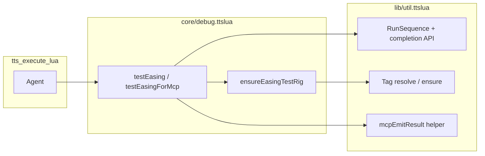

# MCP-ready TTS utilities + easing test (foundational refactor)

## Initiative framing

This work is the **first slice** of a broader goal: make Tabletop Simulator workflows **agent- and MCP-friendly** by improving **shared primitives** in `[lib/util.ttslua](lib/util.ttslua)` (and tightly related patterns), not by adding easing-only workarounds in `[core/debug.ttslua](core/debug.ttslua)`.

The easing test becomes a **reference consumer** that proves the utilities and documents one end-to-end MCP flow.

## Problem recap (expanded drivers and intended solutions)

### 1. Resolvable world objects vs hardcoded GUIDs

**What goes wrong:** `[DEBUG.testEasing](core/debug.ttslua)` (and helpers like `testLookAt`) bind visual demos to fixed six-character GUIDs. In TTS, GUIDs are assigned by the engine; deleting or re-spawning objects invalidates those strings, so `getObjectFromGUID` returns nil and the test skips or degrades while still running earlier validation steps.

**Why it matters for agents:** An MCP-driven run cannot assume a particular save still contains those objects; setup must be **discoverable** (find by tag or similar) or **creatable** (spawn rig) without editing source each time.

**Intended solution:** Generic `**U.`* helpers** to resolve `getObjectsWithTag` with explicit duplicate policy and optional `**ensure`** factory when count is zero. Easing defines namespaced tags (`tr_easing_test_`*) and `**DEBUG.ensureEasingTestRig()`** supplies spawn logic (spotlight data + simple blocks) **through** those helpers, not ad hoc GUID tables.

> 👤**USER COMMENT:** 

---

### 2. Interactive pauses block unattended runs

**What goes wrong:** The visual sequence sets `testWaitingForContinue = true`, prints “type `continueTest()`”, and can busy-wait in a coroutine for a long time. That matches a human at the table but stalls any automation that issues a single `tts_execute_lua` call and expects progress without a second message.

**Why it matters for agents:** Without a mode switch, the agent must either spam `continueTest()` from the bridge or hit MCP timeouts.

**Intended solution:** `**DEBUG.testEasing({ interactive = false })`** (or equivalent) so automated runs **omit** `pauseStep` inserts and **bypass** `continueTest` waits. Default remains `**interactive = true`** for existing HUD/manual use.

---

### 3. `U.RunSequence` is asynchronous; post-sequence work is duplicated ad hoc

**What goes wrong:** `[U.RunSequence](lib/util.ttslua)` starts stepping through functions via `U.waitUntil` and immediately returns a **done predicate** `function() return isDone end`. It does **not** wait for the sequence to finish. Any caller that needs to print a summary, chain another test, or `return` a value “when animations are done” must reinvent timing: poll `isDone()`, use `Wait.time`, or rely on incidental print idle.

**Why it matters for agents:** Every future multi-step scenario (scenes, lighting, NPC intro) hits the same pattern; centralizing it avoids subtle bugs and inconsistent timeouts.

**Intended solution:** A **documented completion API** in util: either optional `**opts`** on `U.RunSequence` (e.g. `onComplete`, sequence-level timeout) or a **companion** such as `U.afterSequenceDone(isDoneFn, opts)`. Easing and other tests **only** use that API—no private wait loops in debug.

---

### 4. MCP completion semantics need a consistent “async Lua finished” contract

**What goes wrong:** `[tts_execute_lua](.tools/tts-mcp/src/index.ts)` treats a session as finished when the snippet **returns** a JSON-serializable value (fast), or when **print idle** / **maxWaitMs** elapses. Async work scheduled with `**Wait.time`** can let the main chunk **return early**, so the bridge may close before follow-up runs unless the implementation is aligned with how TTS **External Editor execute** actually behaves (blocking vs deferred).

**Why it matters for agents:** Without a single contract, one test “works” because it printed enough to trigger idle, while another silently truncates; parsers cannot rely on a stable last line or return payload.

**Intended solution:** (1) **Verify** during implementation whether execute can **block until done** (e.g. coroutine yield) so `**return JSON.encode(report)`** is valid for the whole run. (2) Regardless, add `**U.mcpEmitResult(payload)`** — a **stable prefixed print** (`TR_MCP_RESULT` + JSON) so agents can scrape `prints` reliably. (3) Document in `**.dev/TTS_MCP.md`** when to prefer **return** vs **sentinel print** vs **second MCP call**, and how to set `**maxWaitMs` / `idleTimeoutMs`**.

## Layer 1 — Fundamental utilities (primary deliverable)

### 1a. Sequence completion API

**Goal:** Any feature (tests, scenes, NPC flows) can start `U.RunSequence` and reliably attach **completion** (and optional **timeout / error**) without copying polling glue.

**Direction (pick concrete shape during implementation after verifying TTS execute + coroutine behavior):**

- **Option A — Non-breaking extension:** Add optional trailing argument to `U.RunSequence`, e.g. `opts = { onComplete = function(ok, err) end, maxWaitPerStep = ..., sequenceTimeout = ... }`, preserving existing two-arg call sites.
- **Option B — Companion API:** Keep `U.RunSequence` unchanged; add `U.RunSequenceWithCallback(funcs, opts)` or `U.afterSequenceDone(isDoneFn, opts)` that encapsulates the “wait until `isDone()`” pattern.

**Design constraints to document in code comments:**

- Whether the **External Editor execute** chunk can block until completion (coroutine yield, `Wait.condition`, etc.) or returns immediately when using `Wait.time` — this determines if MCP can `**return JSON`** in the same execute or must use **sentinel print + idle** or a **second MCP call**.
- **Timeout:** cap total wall time; on timeout call `onComplete(false, "timeout")` or return a structured error for MCP.

**Deliverable:** One clear, documented pattern in util that easing and future tests import — **not** a private loop inside `DEBUG.testEasingForMcp`.

### 1b. Tag-based object resolution (generic)

**Goal:** Agents and scripts resolve “the” object for a role without hardcoded GUIDs.

Add helpers in util (names TBD), for example:

- Resolve **zero / one / many** `getObjectsWithTag(tag)` with a **policy**: `error`, `first`, `first_warn` (log duplicate GUIDs), optional `destroy_extras` (default off for safety).
- Optional `**ensure` hook:** `factory(position, tag)` invoked when count is zero (easing rig supplies factories in DEBUG; util stays generic).

Easing tags remain namespaced, e.g. `tr_easing_test_light`, … — defined next to easing rig code, but **resolution logic** lives in util.

### 1c. MCP-oriented result emission (generic)

**Goal:** Predictable machine-readable output for `tts_execute_lua`.

- Small helper e.g. `U.mcpEmitResult(payloadTable)` that `**print`s a single line** with a stable prefix (e.g. `TR_MCP_RESULT`  .. `JSON.encode(payload)`) for agents that rely on **print scraping**.
- Document alongside `**return JSON.encode(...)`** when the execution model allows synchronous completion.

Utility stays generic; individual tests choose keys (`test = "easing"`, `steps = {...}`).

## Layer 2 — Easing rig and test (consumer)

- `**DEBUG.ensureEasingTestRig()`:** Uses util tag resolution + spawn: spotlight from `[lib/npcs_light_spawn_defaults.ttslua](lib/npcs_light_spawn_defaults.ttslua)` / `spawnObjectData` (same pattern as `[core/npcs.ttslua](core/npcs.ttslua)`); simple blocks for center/target/block. Fixed layout near table origin.
- `**DEBUG.testEasing(opts)`:** `interactive` default true; false disables `continueTest` waits and `pauseStep` behavior. Builds `**easingRunReport`** during validation and visual phases.
- **Sequence:** Uses **Layer 1 sequence completion** to run follow-up summary / `mcpEmitResult` / return — whichever the verified execute model supports.
- **Thin MCP entry:** e.g. `DEBUG.testEasingForMcp()` + global alias — only orchestrates `ensureEasingTestRig`, `testEasing({ interactive = false })`, and result emission; **no** custom wait implementation.
- `**testLookAt`:** Same tag resolution as easing.

## Layer 3 — Documentation

Update `[.dev/TTS_MCP.md](.dev/TTS_MCP.md)` as an **agent playbook**:

- Prerequisites and ports (existing).
- **Shared utilities:** sequence completion, tag resolution, result emission — with **copy-paste Lua snippets** for unrelated tasks.
- **Easing test** as one **example** (`return testEasingForMcp()` or equivalent).
- **Timeout guidance** for `maxWaitMs` / `idleTimeoutMs` tied to the chosen completion contract.

## Files to touch (expected)

| File                                     | Role                                                                       |
| ---------------------------------------- | -------------------------------------------------------------------------- |
| `[lib/util.ttslua](lib/util.ttslua)`     | Sequence completion API; tag helpers; optional MCP print helper            |
| `[core/debug.ttslua](core/debug.ttslua)` | Easing rig; refactor `testEasing` / `testLookAt`; MCP entry uses util only |
| `[.dev/TTS_MCP.md](.dev/TTS_MCP.md)`     | Agent playbook + easing example                                            |

**Regression:** Grep for `U.RunSequence(` call sites; ensure backward compatibility if signature changes.

## Verification (after implementation)

- All existing `U.RunSequence` callers still behave as today unless they opt into new parameters.
- New unit or bridge tests if util logic is pure enough to test off-TTS; otherwise document manual TTS checks.
- Easing: manual `testEasing()` still interactive; `testEasingForMcp()` (or equivalent) unattended with rig spawn/reuse.
- MCP: one `tts_execute_lua` receives structured outcome per documented contract.

